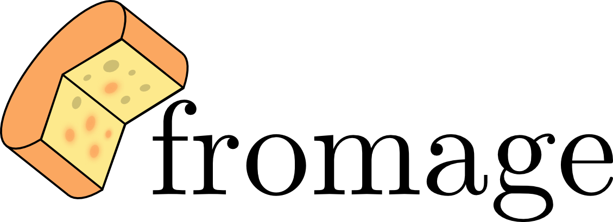

.. fromage documentation master file, created by
   sphinx-quickstart on Tue Feb 13 10:35:39 2018.
   You can adapt this file completely to your liking, but it should at least
   contain the root `toctree` directive.

|

**fromage** (FRamewOrk for Molecular AGgregate Excitation) is a library designed
to support investigation of photophenomena in molecular crystals. Among the
features are:

 * Cross-program ONIOM-style calculations with different electrostatic embedding
   methods
 * Location of energy minima and minimal energy conical intersections
 * Command line geometry manipulation tools
 * Evaluation of exciton coupling values using multiple schemes (under
   development)

.. toctree::
   :maxdepth: 1
   :numbered:
   :caption: General

   overview
   gloss
   tutorial
   license
   contact
   zrefs

.. toctree::
   :maxdepth: 2
   :numbered:
   :caption: Theoretical background

   cluster_models
   ewald
   penalty_func
   pop

.. toctree::
  :maxdepth: 2
  :numbered:
  :caption: Program documentation

  interfaces
  input
  structure_manipulation
  script
  modules

References and indices
======================

* :ref:`refs`
* :ref:`genindex`
* :ref:`modindex`
* :ref:`search`
