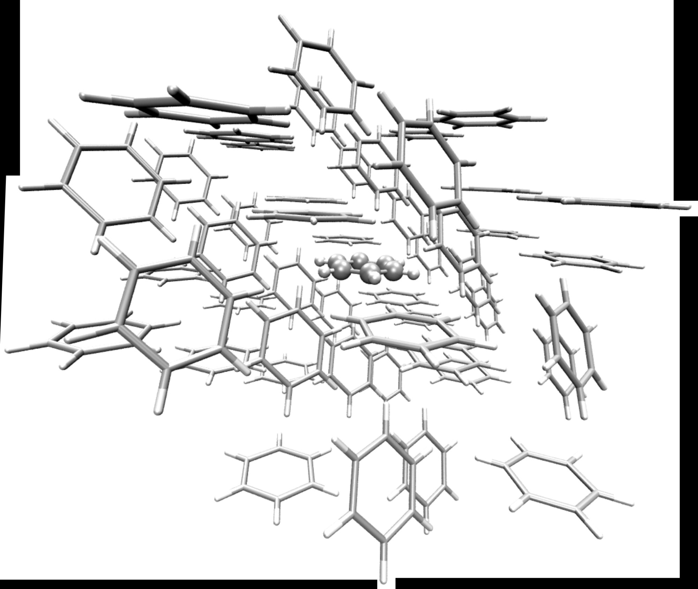

# `fromage` 2.0 Notes

---

## 1. Introduction

The approach presented here integrates a multiscale QM:QM' electrostatic embedding scheme along with nonadiabatic molecular dynamics (NAMD) propagated with FSSH combining the code `fromage` (FRamewOrk for Molecular AGgregate Excitations) [citations] and NewtonX (NX). `fromage` is the first standalone Python library that offers a collection of ready-to-use command-line scripts to create molecular clusters and perform efficient excited-state embedding calculations for learning the photochemistry and photophysics of molecular crystals. It implements the Our own N-layered Integrated molecular Orbital and Molecular mechanics (ONIOM) approach with electrostatic embedding. `fromage` is interfaced with various quantum chemical programs to compute excitation energies and hybrid gradients and Hessians, and supports a variety of molecular or periodic QM methods to compute atomic charges for electrostatic embedding including Ewald periodic embedding methods. For instance, the electrostatic potential fitted in the Merz-Singh-Kollman (MK) scheme, restrained electrostatic potential (RESP), Mulliken population, natural charges, Hirshfeld charges, and atoms-in-molecules (AIM) analysis.

The current implementation enables the use of TD-DFT, ADC(2), CC2, CASSCF and (XMS-)CASPT2 as the high level method for the excited state calculation and DFT(B), HF, AM(X) and PM(X) as the low level method. Currently, only Gaussian, Turbomole, OpenMolcas, DFTB+ and xTB are the software available for the computations for multiscale NAMD. The case of CASSCF and CASPT2 methodologies allows the computation of nonadiabatic coupling (NAC) vectors.

---

## 2. Running the Calculations

NX sees `fromage` as an electronic structure software. So, `fromage` deals with all the calculations required to feed NX with the oscillator strengths, energies, gradients and, when required, NACs. Thus, all input files required for a `fromage` calculation must be included in the `JOB_AD/` directory.

Below, we show a detailed description for preparing all the input files required to use NX with `fromage`. The source code can be obtained from:

[https://github.com/Crespo-Otero-group/fromage/tree/fromage2](https://github.com/Crespo-Otero-group/fromage/tree/fromage2)

The codes that link fromage with NX are distributed upon request. Additionally, a more detailed documentation about `fromage` capabilities and how to install it in your `Python` environment can be found in:

[https://fromage.readthedocs.io/_/downloads/en/latest/pdf/](https://fromage.readthedocs.io/_/downloads/en/latest/pdf/)

### 2.1 `fromage` Preparation

At this point, we assume that `fromage` is accessible within your `Python` environment.

The first step is preparing a cluster model with the molecules respecting the position they have in the crystal packing of the system under study. For that, crystal information is necessary and the unit cell structure along with the cell vectors must be provided in a `config` file as shown below:

**`config` file for preparation of all input files for a calculation with `fromage`:**

```
name Benzene
a_vec  5.5220  0.0000  0.0000   # X-vector
b_vec  0.0000  5.4396  0.0000   # Y-vector
c_vec -2.6933  0.0000  7.1844   # Z-vector
cell_file cell.xyz               # filename with the unit cell
high_pop_program gaussian        # software used to compute the high-level populations
high_pop_file Opt_high.log       # filename with the high-level populations
high_pop_method ESP              # high-level population analysis, in this case RESP charges
low_pop_program gaussian         # software used to compute the low-level populations
low_pop_file Opt_low.log         # filename with the low-level populations
low_pop_method ESP               # low-level population analysis, in this case RESP charges
bond_thresh 1.7                  # Threshold (in Å) to classify intra- (≤ 1.7) and intermolecular distances (> 1.7)
bonding dis                      # Type of bonding used for detecting full molecules (options are dis, cov and vdw)
atom_label 1                     # Atom label in the cell.xyz file used as the center of the cluster
clust_rad 8                      # Cluster radius (in Å)
```

To run a preparation calculation, create a directory, for instance, `fro_prep_calc/` and include all the following files in the directory where the preparation is going to be performed:

- `config` — The input file with all the options for the preparation described before
- `cell.xyz` — The XYZ file containing the coordinates of the unit cell
- `Opt_high.log` — A Gaussian output file containing the population analysis performed at the high level
- `Opt_low.log` — A Gaussian output file containing the population analysis performed at the low level
- `mh.template` — A template file for the high-level calculation of the model system
- `ml.template` — A template file for the low-level calculation of the model system
- `mg.template` — A copy of the `mh.template` file
- `rl.template` — A template file for the low-level calculation of the real system

The `mh/ml/rl.template` files are the input files required to run the calculations under the ONIOM scheme at the high level for the model region (mh), the low level for the model region (ml), and low level for the real region (rl), i.e., the whole cluster produced during the preparation, representing the crystalline structure of the system under study. The `mg.template` file is required to run the preparation but not used in the dynamics module (to see more details, check `fromage` documentation).

Currently, `fromage` is prepared to read the population analysis from `cp2k` and `Gaussian` software packages. However, in this version, the NX&fromage module is only interfaced with `Gaussian`, `Turbomole`, `OpenMolcas`, `dftb+` and `xTB`. Besides, the current module to perform the initial conditions with the option of checking the excitation energies is only possible with `Gaussian` and `Turbomole`. Hence, in this tutorial, we show how to set the `mh/ml/rl.template` input files assuming that both high-level and low-level calculations are done with `Gaussian` and then explain what changes when using the other options.

Before explaining how to set all the files to proceed with the preparation calculations, we have to bear in mind that `fromage` offers two main schemes: a **frozen environment**, and a **flexible environment**. We start with the case of a frozen environment.

#### 2.1.1 Frozen Environment

We start considering that `Gaussian` software package will be used for the high and low level calculations.

**`mh.template` file for preparation:**

```
%chk=gck.chk
%mem=16GB
%nproc=4
#p td=(nstates=&NSTATES, root=&STATE) high-level_method basis_set charge force symmetry=none IOP(3/59=14)

mh

0 1
XXX__POS__XXX

XXX__CHARGES__XXX
-- Final Blank line --
```

> The keywords `high-level_method` and `basis_set` must be replaced with the desired method and basis set for the high-level calculation accordingly.

**`ml.template` file:**

```
%chk=gck.chk
%mem=16GB
%nproc=4
#p low-level_method basis_set charge force symmetry=none IOP(3/59=14)

ml

0 1
XXX__POS__XXX

XXX__CHARGES__XXX
-- Final Blank line --
```

**`rl.template` file:**

```
%chk=gck.chk
%mem=30GB
%nproc=4
#p low-level_method basis_set force symmetry=none IOP(3/59=14)

rl

0 1
XXX__POS__XXX

XXX__FIX__XXX
-- Final Blank line --
```

> The keywords `low-level_method` and `basis_set` must be replaced with the desired method and basis set for the low-level calculation accordingly.

To run the preparation, navigate to the `fro_prep_run/` directory and invoke:

```
fro_prep_run.py
```

This step could take from some minutes to a couple of hours, depending on how big the system under study is.

Once the preparation has finished, the directory should contain:

```
config  mg.template  mh.template  ml.template  Opt_high.log  shell.xyz
cell.xyz  mol.init.xyz  Opt_low.log  prep.out  rl.template  mg/  mh/  ml/  rl/
```

The file `mol.init.xyz` contains the molecule or molecules (in this case just one) considered as the model region, whereas the file `shell.xyz` contains all the other molecules surrounding the model region. `mol.init.xyz` + `shell.xyz` represent a molecular cluster.



---

Now, if `xTB` or `dftb+` are used to model the low-level region, some modifications have to be done.

##### xTB

For the calculation of the model system (`ml/`), three files are required: `ml.temp`, `xtb.input` and `xtb_charges.pc`. `ml.temp` is the template of an `.xyz` file, with the number of atoms in the first line and then a flag indicating where the XYZ coordinates must be included. This is an example of `ml.temp` for benzene:

**`ml.temp` file for the low-level model calculation:**

```
12

XXX__POS__XXX
```

The `xtb.input` file should contain the following lines:

**`xtb.input` file:**

```
$embedding
input=xtb_charge.pc
$end
```

This tells `xTB` that point charges embedding is used in the model region calculation. The point charges are included in the file `xtb_charges.pc` following this format:

**`xtb_charge.pc` file:**

```
# nq     # number of point charges
q1   X1   Y1   Z1
.
.
qnq  Xnq  Ynq  Xq
```

where `q_i` is the value of the point charges that come from the `fromage` preparation calculation and X, Y and Z are the corresponding coordinates in Å. A useful shortcut when running `fro_prep_run.py` with `xTB` is to include these lines in the file `ml.template`:

```
XXX__CHARGES__XXX
```

After the preparation is done and the file `ml/ml.temp` is produced, edit the `ml.temp` file adding the number of point charges `nq` in its first line, move the last column (containing the values of the point charges) to the first column, and rename it as `xtb_charges.pc`.

The `rl.temp` file is just a template of a `.xyz` file that must include all the coordinates of the cluster. To prepare it, copy the `shell.xyz` to the `rl/` directory and rename it to `rl.temp`. Change the first line of this file to also account the atoms in the model region, i.e., the total amount of atoms of the whole cluster. Thus, the first line should be `#QM atoms + #QM' atoms`. Then, after the blank line, add the flag `XXX__POS__XXX` to tell `fromage` to include the coordinates of the QM region there. The `rl.temp` file should then look like:

**`rl.temp` file for the low-level real model calculation:**

```
#NATOMS   (Number of atoms of the whole cluster)

XXX__POS__XXX
Symbol_At1  X_At1  Y_At1  Z_At1
Symbol_At2  X_At2  Y_At2  Z_At2
.
.
Symbol_AtnQM'  X_AtnQM'  Y_AtnQM'  Z_AtnQM'
```

##### dftb+

Now, we consider using `dftb+` for the low-level calculations. This case is simple and straightforward. Before running the `fromage` preparation, two `dftb+` input files including the options for force calculations must be included with the names `ml.template` and `rl.template`, respectively, using the XYZ format as defined by `dftb+`. `ml.template` must include the lines for the point charges embedding in the Hamiltonian section as shown below:

**Part of the `ml.temp` file that has to be modified for the low-level model input:**

```
ElectricField = {
  PointCharges = {
    CoordsAndCharges [Angstrom] = {
      XXX__CHARGES__XXX
    }
  }
}
```

After the preparation has finished, the `ml.temp` and `rl.temp` files in the directories `ml/` and `rl/`, respectively, must be renamed to `dftb_in.hsd`.

If `OpenMolcas` or `Turbomole` are used for the high-level calculations, the point charges section must respect the format specified in the documentation of each code. In the case of `Turbomole`, the `X Y Z` values are expressed in Bohr radius.

If initial conditions are required from a Wigner sampling, once the cluster has the desired size and shape, the next step is to run a `fromage` optimisation in the selected electronic state. We use in this tutorial the ground electronic state as an example. To do this, it is recommended to create another directory, for instance, `Ben_S0min`, to get a relaxed structure from which the Wigner sampling can be done for the initial conditions. Once the optimisation has converged, a normal modes calculation has to be done containing the point charges. Then, the output of the normal modes calculation will be used to set the initial conditions as is normally done in NewtonX.

##### MOPAC-PI (fomo-ci)

Currently in development. Frozen working, make sure you point to the bin for mopac-pi as MOP as we call $MOP/... etc.


#### 2.1.2 Flexible Environment

Now, we consider setting everything for a flexible environment. The approach followed considers that the flexible environment is surrounded by a fixed environment which prevents the system from increasing its volume artificially during the optimisation or dynamics. For this, the preparation calculation is done in the exact same way as explained in Section 2.1.1. Then, the `shell.xyz` file is divided in two: `shell_flex.xyz`, which contains all the atoms which are optimised or evolved at the QM' level, and `shell_frozen.xyz` which contains the more external clamped atoms.


When the optimisation or dynamics is done with a flexible environment, `fromage` updates the position and the values of the point charges at every optimisation/dynamics step. Thus, the input files `mh/mh.temp` and `ml/ml.temp` must not have the point charges as in the case for the rigid environment and only the files `mh.temp` and `ml.temp` are required. The input file to set the fromage calculation should look as follows:

**`fromage.in` file for an optimisation with flexible environment:**

```
high_level      program_name   # Select the name of the software for high level calculations (default: gaussian)
low_level       program_name   # Select the name of the software for low level calculations (default: gaussian)
relax           yes            # Keyword to tell fromage to do an optimisation with the flexible environment
natoms_flex     168            # number of atoms within the flexible environment (those in the shell_flex.xyz file)
```

Then, instead of calling `fro_run.py`, you call `fro_run_flex.py`.

At every optimisation step, `fromage` saves all the flexible atoms (those described at both the QM and the QM' level) in `geom_mol.xyz`.

Once the optimisation is converged, normal modes are computed with a QM:QM' multiscale approach. For this, the `geom_mol.xyz` containing the optimised structure must be present in the directory. The input file has to include the keyword `normal_modes yes`. `fromage` will set the input files to compute the Hessians in the `mh/`, `ml/` and `rl/` directories and will combine all the information to get the ONIOM Hessian and the normal modes with their respective frequencies. These are saved in a molden format file named `oniom.freq.molden`. Additionally, input files for `FCclasses3` are also generated. Additional information about the Hessians is also included in the output file `fromage.out` whether the `verbose` keyword in `fromage.in` is set to 2.

The calculation of the Hessian can take long computing times, especially those for the whole cluster. Therefore, it is recommended to run all the calculations separately using the best resources for each calculation and then gather all the data in the `mh/`, `ml/` and `rl/` directories. Then, `fromage` can be called in a reading mode to compute the ONIOM frequencies and normal modes by including `read_hessian yes` in `fromage.in` (note that in this case the keyword `normal_modes` still remains `yes`).

---

## 3. Dynamics Combining fromage & NewtonX

As explained before, both types of environments — frozen and flexible — are implemented. In this section, we explain how to set the input files to compute absorption/emission spectrum, initial conditions and adiabatic and nonadiabatic dynamics.

In the current version, the dynamics can only be done with `Gaussian` ((TD-)DFT), `turbomole` (TD-DFT, ADC(2) and CC2) and `OpenMolcas` ((XMS-)CASPT2, CASSCF) to describe the high-level region. For the low-level region, `Gaussian`, `turbomole`, `xTB` and `dftb+` can be used.

### 3.1 Frozen Environment

#### 3.1.1 Initial Conditions

In this case, the normal modes are computed at the desired level of theory and including point-charge embedding. Hence, the initial conditions are prepared in the exact same way as in a normal calculation for NewtonX but the template file in `JOB_AD/` has to include the point charges.

#### 3.1.2 Dynamics

All the files and directories that `fromage` needs for a calculation must be in the `JOB_AD` directory:

```
ml/  mh/  rl/  fromage.in  mol.init.xyz  shell.xyz
```

**`fromage.in` file for dynamics with NewtonX with frozen environment:**

```
high_level      program_name   # options available: gaussian, turbomole, turbomole_tddft, molcas
low_level       program_name   # options available: gaussian, xtb and dftb
newtonx     yes                # activate the NewtonX option
nprocs      #number            # number of processors to run each calculation
singlestate    1               # To compute the ONIOM gradient only for the current state in the dynamics
spin    0                      # Only singlets are considered (dynamics involving triplets is not implemented yet)
```

##### Gaussian

When `Gaussian` is selected, there is an extra file that must be in the `JOB_AD` directory. That file is `basis`, and it only contains the basis set selected for the high-level calculation (in `mh/`). This is also required when you set a calculation in the gas phase with `Gaussian`.

All the input files are set in the same way as in the case of an optimisation in frozen environments (Section 2.1.1). The only difference is in the input file `mh/mh.temp`, which must be set as follows:

**`mh.temp` file for dynamics with NewtonX with frozen environment:**

```
#p td=(nstates=&NSTATES,root=&STATE) ωB97XD 6-31G* charge force symmetry=none IOP(3/59=14)
```

The flags `&NSTATES` and `&STATE` are set automatically by `fromage`.

### 3.2 Flexible Environment

#### 3.2.1 Initial Conditions

The initial conditions can be computed using the normal modes obtained via diagonalisation of the ONIOM Hessian as implemented in `fromage` (Section 2.1.2). The normal modes are saved in a molden-type file. NX can read this file to do a Wigner sampling. For initial conditions, the `fromage` input file has to be set as follows:

**`fromage.in` file for initial conditions with NewtonX with flexible environment:**

```
high_level      program_name   # options available: gaussian, turbomole, turbomole_tddft, molcas
low_level       program_name   # options available: gaussian, xtb and dftb
newtonx     yes                # activate the NewtonX option
nprocs      #number            # number of processors to run each calculation
singlestate    1               # To compute the ONIOM gradient only for the current state in the dynamics
spin    0                      # Only singlets are considered (dynamics involving triplets is not implemented yet)
single_point   yes
hl_natoms  12                  # number of atoms in the high-level region
ll_flex_natoms  168            # number of flexible atoms in the low-level region
```

In this case, the `shell.xyz` file contains all the atoms described at the low level of theory with the first 168 atoms being those flexible.

If `Gaussian` were to be used, the input files `mh.temp` and/or `ml.temp` would be normal `Gaussian` input files with the flags `XXX__POS__XXX` and `XXX__CHARGES__XXX` for the positions and the point charges obtained for each sampled geometry. An input file for the high-level calculation looks like this:

**`mh.temp` file for initial conditions with Gaussian with flexible environment:**

```
%chk=gck.chk
%rwf=gaussian
%mem=46GB
%nproc=6
#p td=(nstates=&NSTATES) wb97xd 6-31G* charge symmetry=none IOP(3/59=14)

Job title

0 1
XXX__POS__XXX

XXX__CHARGES__XXX
```

For `Turbomole`, the following lines have to be added to the control file:

**`control` file for initial conditions with Turbomole (ADC2 or CC2) with flexible environment:**

```
$point_charges
  XXX__CHARGES__XXX

$excitations
  irrep=a  &NEXC  &NPRE  &NSTART
  spectrum  states=all  operators=xdiplen,ydiplen,zdiplen
```

**`control` file for initial conditions with Turbomole (TD-DFT) with flexible environment:**

```
$point_charges
  XXX__CHARGES__XXX
&SOES
$scfinstab rpas
$spectrum ev
```

Something important to consider when `Turbomole` is used is that the `control` file has to be copied and pasted as `control.temp` within the `mh/` directory and also has to be copied and pasted (as `control`) in `JOB_AD` (i.e., one directory before).

Initial conditions using OpenMolcas within a flexible environment are yet to be implemented. However, if you want to use it, please get in touch and scripts for the Wigner sampling and analysis of the spectra can be provided.

#### 3.2.2 Dynamics

Setting dynamics with NX and flexible environment is easy and straightforward. The input file `fromage.in` is the same as for initial conditions shown before but the keyword `single_point` must be set to `no` or deleted from the file. Then, if `Gaussian` is used for the high-level calculations, the `mh.temp` file must include the option `root=&STATE` as shown in Section 3.1.2. If `Turbomole` is used instead, the keyword `&GRAD` must be included under the `$excitations` block when ADC(2) or CC2 methods are used, or `&EXOPT` for TD-DFT calculations.

If OpenMolcas is used for the high-level method selection, an initial active space must be included in the `mh/` directory and the `mh.temp` file has to be set as follows:

**Example of the `mh.temp` file for dynamics with OpenMolcas with flexible environment:**

```
&GATEWAY
 coord=geom.xyz
 basis=ANO-S-VDZP
 Group=Nosymm
 RICD
 XField
 XXX__CHARGES__XXX

&SEWARD

&RASSCF
 FileOrb=molcas.RasOrb
 Spin=1
 Charge=0   # Or the corresponding value
 Nactel=4 0 0
 Inactive = 144
 Ras2=4
 CIRoot=6 6 1

&GRAD

&NAC
```

All the results are printed in the same manner as they are printed for dynamics in the gas phase except for the file `fromage_dyn.xyz` that contains the coordinates for the whole cluster for each timestep.

---

## 4. Dynamics with the Internal Modules Available in fromage

### 4.1 Initial Conditions

The normal modes are computed at the desired level of theory including point-charges embedding. The initial conditions can be generated using the Wigner Sampling module implemented in `fromage`. Currently, only the formats from `Gaussian`, `Orca`, `Turbomole` and `Molden` are implemented. Initial conditions can also be generated with NewtonX and then parsed with `fromage` to set the proper format.

To generate the file with the initial conditions, the function `dynamixsampling.py` must be invoked. This function is available as an executable script in the environment where `fromage` was compiled. Run `dynamixsampling.py -h` to see how to use this function and the different options available. The file `initconds` containing the initial geometries and velocities is then generated. Initial conditions via Boltzmann distribution can also be generated. Additionally, the Wigner sampling can be rescaled by using the function `scaled_wigner.py`.

The next step is to generate the set of files with the initial conditions to run the trajectories. For this, the function `setup_dyn.py` must be invoked. Conditions for dynamics in the gas phase and in the solid state with frozen and flexible environments can be generated. In the latter case, the number of flexible atoms in the QM' region along with the number of the atoms in the higher QM region have to be specified using the options available.

### 4.2 Dynamics

When the initial conditions are intended for nonadiabatic molecular dynamics, the file `fromage.in` must be set as follows:

**`fromage.in` file for surface hopping dynamics with `fromage`:**

```
high_level      turbomole/turbomole_tddft/Gaussian/Molcas
low_level       xtb/dftb+
nprocs          8             # For Molcas calculations
dynamics        yes
check           output.chk   # Output file with information of energies and populations
init_state      2             # Initial state: 0 means S0
spin            0             # 0 singlets, 1 triplets
states          3             # Number of states. In this case, up to S2 is considered
singlestate     1             # 1 means compute the gradient only of the current state to save computing time
nactype         ktdc          # ktdc: curvature-approximated time-derivative coupling. nac: explicit calculation of the NAC
coupling        1 2 2 3       # pair of states to compute the couplings
time            200           # total time in fs
step            0.5           # timestep in fs
hop_method      FSSH          # Surface hopping method: FSSH/GSH
vel_file        velocity      # File containing the initial velocities
adj_mom         1             # Method to readjust the momentum: 0/1/2/3
chk_stp         100           # Checkpoint step to save relevant data to restart the trajectory
e_cons          0.001         # conservation energy threshold in a.u.
natoms_flex     168           # flexible atoms in the QM' region
```

For more information, check the test cases in `fromage/dynamics/fro_dyn_test`.
